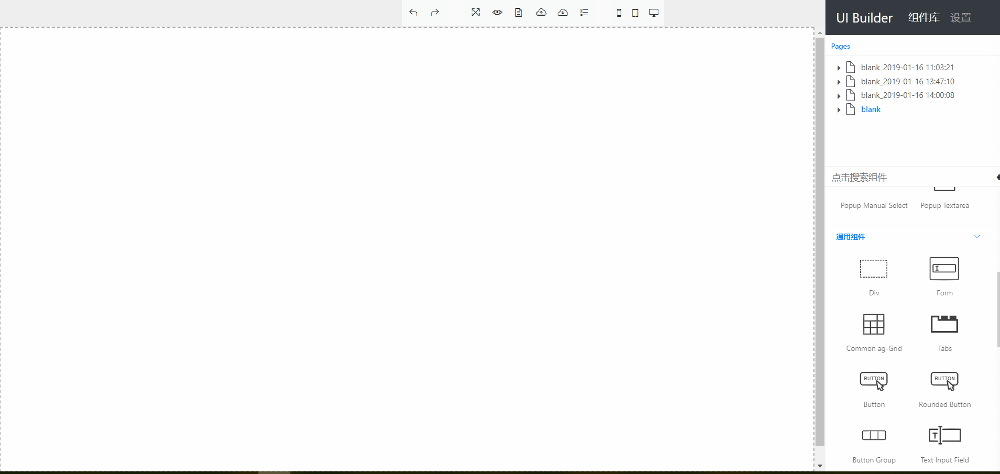

# issues

1. 解决重叠元素拖拽问题
    1. 使用jqueyr.top-droppable.js，需要解决iframe问题(jquery.top-droppable-fix.js包含简单iframe判断)。该方案基于z-index，需要显示设置z-index，需要考虑grid widget和弹出框中相同元素设置不同的z-index，代码侵入性强。
    2. 考虑在弹出框打开的时候，禁用弹出框外的元素droppable功能，关闭时启用droppable功能。

    优先考虑第二种方案

2. 表格行和列翻转

    参考[GitHub Project](https://github.com/LMFinney/ag-grid-partial)实现翻转逻辑。
    在UI Builder中表格进行显式的反转，实现复杂且没有必要，显式的翻转不在项目规划中。

3. 嵌套弹出框拖拽

    弹出框弹出后，需要设置其他元素为不可拖拽区域。弹出框允许嵌套，只有最外层弹出框是可拖拽区域，关闭一层弹出框后，将现在的最外层设置为可拖拽区域。当弹出框全部关闭后，恢复原有的其他可拖拽区域。

4. draggable区域中contenteditable不可编辑

    测试发现，gridster中的可拖拽widget和利用jquery-ui实现的sortable区域中，设置了contenteditable的文本节点不可编辑。对逻辑做对应调整，双击进入编辑模式后，disable可以拖拽的区域。当光标移开可编辑区域后，恢复原有的可拖拽区域。

5. ag-grid ag-theme-blue分页组件样式问题

    ag-grid 19.0.1修复了ag-theme-blue主题分页组件中文本不显示的问题，但不能调用setColumnDefs动态重新渲染表格。在官方修复之前，暂时手动修改引入的脚本。

6. 允许修改导出的自动生成的脚本的提交记录的撤销

    通过修改脚本元素type可以防止在UI Builder中被浏览器解析脚本，从而可以通过不删除脚本的方式到达保留用户对脚本修改的目的。但如果放开这个限制，可能会带来用户自由修改自动生成的脚本和后期自动生成脚本自身内容更新造成冲突。我们可以采用类似Git的方式，允许用户选择保留的内容，但实现会非常麻烦，也不是该项目本身的初衷。

    早期导入页面时，删除原有脚本的方式会破坏用户自定义脚本和自动生成脚本的顺序关系。对原有的方式做出以下调整：

    1. 导入页面时，修改指定脚本的类型，使浏览器不去解析执行脚本内容；
    2. 导出页面时，删除自定义脚本类型；对自动生成的不同功能的脚本添加不同的标识，导出时更新对应脚本的内容。

    修改脚本类型可以保存用户对自动生成脚本的修改。但因为项目需要支持对生成脚本的更新和修复，如果用户直接修改自动生成脚本内容，会造成两者的冲突。所以导入时保留脚本只是为了记录脚本的顺序结构，导出时仍然会用新的自动生成的脚本覆盖原有的内容。

7. 对导出页面的处理性能

    定时保存功能，会对html文档节点进行处理，处理平均时间到达了50ms以上，后期可以进行优化。保存到localStorage的时间平均不到1ms，几乎可以忽略不计。

8. Grid Widget的删除

    直接删除并恢复，可以通过触发父页面#delete-box的点击事件，传递被删除节点作为额外参数实现。但gridster本身支持删除widget后，widgets的重新排列布局，造成即便恢复元素，之前的布局也无法恢复。
    现在暂时通过弹窗提示删除widget的操作不可撤销。

9. Gridster网格加载速度

    Gridster自动生成内联样式，css规则中的单位为绝对值，只适配UI Builder中的视图。如果在导出的页面中，利用Gridster动态进行初始化，加载速度会很慢。在导出页面的同时，直接利用正则表达式将Gridster内联样式中的绝对值替换成相对值，加快页面的加载速度。

10. jQuery UI Tabs

    参考[Using jQuery UI Tabs with the `base` Tag](https://www.tjvantoll.com/2013/02/17/using-jquery-ui-tabs-with-the-base-tag/)
    保存在localStorage中的页面或通过上传操作导入的页面，是通过将页面内容写入iframe中完成的。虽然可以显式设置iframe的src，但在iframe中获得的location.href仍然是父页面的location.href。因为iframe中外部依赖路径是相对于模板文件的路径，不是父页面的路径，所以设置了base标签来正确解析外部依赖。但在使用jQuery UI Tabs中，标签页的路径是相对于base来解析的，造成和location.href不同，jQuery UI在解析时如果发现不同，处理方式是通过ajax请求将返回的内容动态添加到标签页对应的内容区域，所以标签页解析错误。jQuery UI的处理方式虽然不是一个bug，但是违背直觉，同时没有提供选项来设置解析方式。临时解决办法是
    iframe依赖文件加载完毕后，移除base标签。

11. jQuery UI嵌套droppable拖拽问题

    **问题截图**

    

    **问题描述**

    jQuery UI多个droppable元素嵌套时，拖动外层的droppable会使内层的droppable元素处于可以进行拖拽放置的状态。由于代码中会在drop结束后将draggable元素变为droppable的子元素，造成将父元素附加到子元素中，抛出`Uncaught DOMException: Failed to execute 'appendChild' on 'Node': The new child element contains the parent.`异常。

    **解决方式**

    现在的解决方式是拖拽开始时，将draggable子元素中的droppable设置为`disable`，拖拽结束后重新设置为`enable`。另外也可以考虑在drop结束后，判断draggale和droppable的层次关系，如果draggable是droppale的父元素，不执行元素附加操作。

12. jQuery UI多个元素同时Resize问题

    jQuery UI支持通过`Resizable`中的`alsoResize`设置多个元素同时改变大小的操作。但默认的大小改变逻辑不符合常见的使用习惯。比如，如果元素左侧向左拉，该元素会变长，同时该元素的左上角会对应向左移动。但与之关联同时拉长的元素却保持左上角位置不变，只是元素横向拉长，造成该操作下两个元素向相反方向拉长。所以，在多元素同时改变大小时，通过自定义逻辑实现更符合使用习惯的操作。
